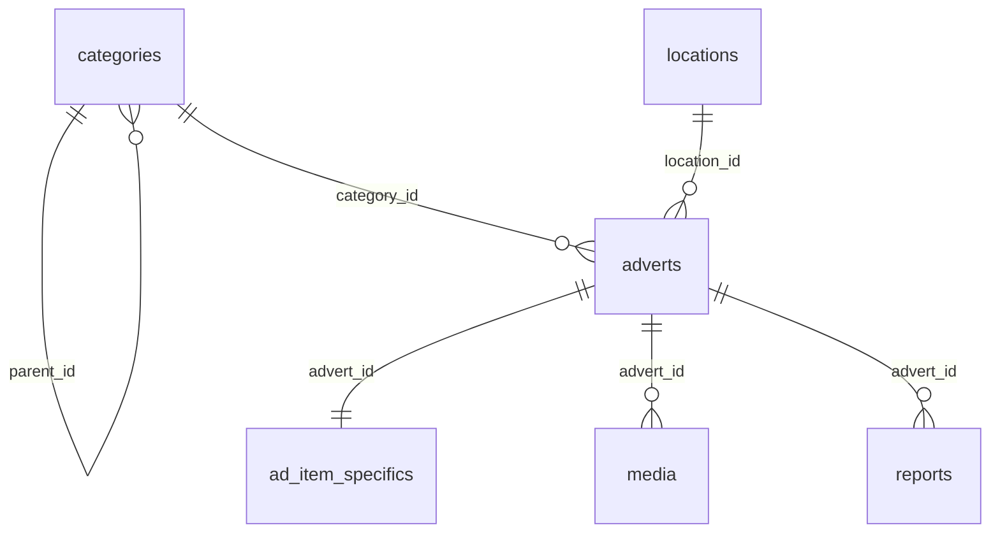

# LyVoX Requirements

> Связанные документы: [ARCH_RULES](./ARCH_RULES.md) • [ARCHITECTURE](./ARCHITECTURE.md) • [API_REFERENCE](./API_REFERENCE.md) • [INSTALL](./INSTALL.md) • [TODO](./TODO.md) • [PLAN](./PLAN.md)

<!-- Short aliases used by PLAN.md -->

<span id="REQ:Core"></span>
<span id="REQ:Security"></span>
<span id="REQ:Stack"></span>
<span id="REQ:Data"></span>
<span id="REQ:Quality"></span>
<span id="REQ:Integrations"></span>
<span id="REQ:Compliance"></span>
<span id="REQ:Roadmap"></span>

**Правило без дублей:** ограничения/версии — в ARCH_RULES.md; ERD/RLS/ENV/Roadmap — здесь; фактическая архитектура и журнал — в ARCHITECTURE.md; детальные API — в API_REFERENCE.md.

## Project Overview

LyVoX is a C2C/B2C marketplace focused on EU audiences that connects private sellers and businesses. The product allows visitors to browse category hierarchies, view listing details with image galleries, and post new adverts. Authentication relies on Supabase magic links, while trust-and-safety flows include phone verification, trust scoring, buyer complaints, and an admin moderation console.

- Detailed domain guides live under [docs/domains](./domains) (profiles, adverts, moderation, trust_score, phones, consents, devops).

Key capabilities implemented in the codebase:

- Category landing pages with nested navigation and breadcrumbs backed by Supabase `categories`.
- Listing creation workflow with draft creation, editing, publishing, and Supabase Storage uploads for media.
- Public advert detail pages displaying pricing, location, and gallery assets.
- Account area with profile details, trust score display, and phone verification via SMS codes.
- Complaint submission from advert pages and moderation tooling for administrators.
- Category **Transport** (cars, motorcycles, parts) must collect structured attributes (make, model, year, mileage, condition) via cascading dropdowns powered by the normalized Supabase tables `vehicle_makes`, `vehicle_models`, and `vehicle_generations`, and surface a dedicated EV subcategory for battery vehicles.

## System Architecture

### Frontend

- Next.js 16 App Router project (React 19.2, TypeScript 5.9) inside `apps/web`.
- Client components rely on the `@supabase/ssr` browser client to query Supabase tables in real time.
- Layout combines `TopBar`, `MainHeader`, `LegalFooter`, `BottomNav`, and `ViewportBottomSpacer` to optimize mobile UX.
- `middleware.ts` hydrates Supabase sessions on every request so API routes and server components can reuse auth context.
- UI elements are built on shadcn/ui patterns with Radix primitives (dialog, select, tabs) and Tailwind CSS 4.

### Backend / API

- Next.js API routes under `app/api/**` provide server-side operations for profile management, phone OTP, listings, and moderation.
- API handlers use `supabaseServer()` (anon key + cookies) for user-scoped queries and `supabaseService()` (service role) for privileged admin tasks.
- The auth callback route exchanges Supabase magic-link codes before redirecting back into the App Router experience.
- Logging is centralized in a `logs` table for audit trails on phone verification and moderation actions.
- `/api/auth/register` creates Supabase users with email verification, records `profiles.consents`, and redirects new sessions to the `/onboarding` checklist.

### Database & Storage

## Chat & Conversations (proposed)

- Tables: `public.conversations`, `public.conversation_participants`, `public.messages` with RLS restricting access to dialog participants and admins.
- Realtime: changes on `public.messages` (INSERT/UPDATE) are broadcast via Supabase Realtime; client-only subscriptions in `use client` components.
- API: server actions/REST for start/send/read with rate limiting; SSR loads initial history, client subscribes for live updates.
- Moderation: message-level reports integrate with `public.reports` (target type `message`), auto-mute participants based on confirmed complaints.
- Retention: messages kept 6 months after deal completion or inactivity; DSAR export and cron cleanup are required.

- Supabase Postgres hosts core tables: `adverts`, `media`, `categories`, `profiles`, `phones`, `phone_otps`, `reports`, `trust_score`, `logs`, plus supporting tables such as `ad_item_specifics`, `vehicle_makes`, `vehicle_models`, `vehicle_generations`, `steering_wheel`, `vehicle_colors`, `vehicle_doors`, `vehicle_conditions`, `engine_types`, `drive_types`, `vehicle_options`.
- Supabase migrations `20251004120000` ? `20251004122000` provision the `reports` and `trust_score` tables, attach `updated_at` triggers, seed baseline RLS, and expose the `trust_inc(uid, pts)` helper function.
- Supabase Storage bucket `ad-media` stores advert images; paths follow `user_id/advert_id/timestamp-filename`.
- Category taxonomy is seeded via `scripts/seedCategories.ts`, which consumes `seed/categories.ru.yaml`.
- Transport make/model metadata lives in the Supabase tables `vehicle_makes`, `vehicle_models`, and `vehicle_generations`; server-side code must expose dependent dropdown options for make → model and validate EV listings against the EV subcategory rules.
- Authentication data is provided by Supabase Auth (`auth.users`), reused across API handlers and RLS policies.

### Infrastructure & Integrations

- Application is designed for Vercel deployment (Next.js build scripts) and Supabase-hosted backend services.
- Twilio Lookup and Messaging APIs deliver OTP flows for phone verification and enrich phone metadata.
- Cloudflare WAF is planned as an upstream protection layer for the public site.
- Upcoming integrations include Itsme OAuth for KYC and KBO/BCE API checks for business accounts.

## Technologies & Libraries

- Next.js 16 with Turbopack, React 19.2, TypeScript 5.9.
- Tailwind CSS 4, `clsx`, `tailwind-merge` for styling utilities.
- Radix UI primitives wrapped in shadcn/ui components (`button`, `dialog`, `select`, `tabs`, etc.).
- Supabase client libraries: `@supabase/ssr` (0.7.x) for browser/server helpers and `@supabase/supabase-js` (2.76.x) for service role usage. Мы удерживаем `@supabase/ssr` на ветке 0.7.x до выхода новой стабильной версии; апгрейд допустим только после успешных `pnpm install`, `pnpm exec tsc --noEmit` и ручного SSR smoke-теста (серверный `supabaseServer()` читает профиль).
- Form handling and UX: `react-hook-form`, `sonner` toasts, `lucide-react` icons.
- Turborepo + pnpm workspace for monorepo orchestration; Husky + lint-staged enforce formatting.

## Authorization & Permissions

All critical flows rely on Supabase sessions. Admin-only actions check the JWT `app_metadata.role` claim through the `public.is_admin()` helper before escalating to the service-role client. The `supabaseService()` helper is only constructed inside server routes that require privileged writes.

### Permission Matrix

| Action                            | Guest                          | Authenticated User | Admin / Service Role              |
| --------------------------------- | ------------------------------ | ------------------ | --------------------------------- |
| Browse adverts, media, categories | ✅ read-only (public policies) | ✅                 | ✅                                |
| Create advert (draft)             | ❌                             | ✅ (owner)         | ✅                                |
| Edit advert                       | ❌                             | ✅ (owner)         | ✅                                |
| Delete advert                     | ❌                             | ✅ (owner)         | ✅                                |
| Upload / reorder media            | ❌                             | ✅ (owner)         | ✅                                |
| File report on advert             | ❌                             | ✅                 | ✅                                |
| List reports                      | ❌                             | ❌                 | ✅ (role="admin")                 |
| Resolve report (accept/reject)    | ❌                             | ❌                 | ✅ (role="admin")                 |
| Adjust trust score                | ❌                             | ❌                 | ✅ (`trust_inc` via service role) |
| Request phone OTP                 | ❌                             | ✅ (own phone)     | ✅                                |
| Verify phone OTP                  | ❌                             | ✅ (own phone)     | ✅                                |

## Row-Level Security & Access Policies

Migrations `20251004122000_initial_reports_policies.sql` and `20251005191500_enable_rls_and_policies.sql` enable RLS across the public schema and introduce the `public.is_admin()` helper that inspects `app_metadata.role` inside JWT claims.

- `public.adverts`: public `SELECT` is limited to rows where `status = 'active'`; authenticated owners (`user_id = auth.uid()`) can read and manage their own listings; admins detected via `public.is_admin()` have full access.
- `public.media`: media for active adverts is publicly readable; authenticated owners manage their own assets; admins manage all media through `public.is_admin()`.
- `public.profiles`: owners can select/upsert/update/delete their profile (`id = auth.uid()`); admins bypass via `public.is_admin()`.
- `public.phones`: owners can read and upsert their verified number (`user_id = auth.uid()`); admins manage via `public.is_admin()`.
- `public.phone_otps`: owners control their OTP history; admins can review or purge attempts via `public.is_admin()`.
- `public.reports`: reporters can see submissions they created; advert owners can read reports tied to their listings; admins manage moderation state via the service role or `public.is_admin()`.
- `public.trust_score`: owners read their own score; admins adjust trust via `public.is_admin()` or the `trust_inc` helper.
- `public.logs`: authenticated sessions insert audit entries for themselves; read access is restricted to the service role or `public.is_admin()`.
- `public.categories` / `public.locations`: `SELECT` is public for catalogue browsing; writes remain limited to service-role tooling and seeding scripts.
- `public.ad_item_specifics`: RLS is still disabled; rows are currently touched only through owner-scoped advert mutations, and tightening policies should accompany future schema work.

## API Surface

Detailed request/response contracts, error codes, and curl recipes are documented in `docs/API_REFERENCE.md`. Update that file whenever API handlers change.

## Environment Variables

| Name                            | Required    | Scope           | Notes                                                                |
| ------------------------------- | ----------- | --------------- | -------------------------------------------------------------------- |
| `NEXT_PUBLIC_SUPABASE_URL`      | yes         | client & server | Supabase project URL (exposed publicly).                             |
| `NEXT_PUBLIC_SUPABASE_ANON_KEY` | yes         | client & server | Supabase anon key used by browsers and middleware.                   |
| `NEXT_PUBLIC_SITE_URL`          | recommended | client          | Canonical site origin for link generation (non-sensitive).           |
| `SUPABASE_SERVICE_ROLE_KEY`     | yes         | **server-only** | Service role key for admin APIs; never expose to client bundles.     |
| `SUPABASE_URL`                  | dev scripts | server          | Base URL used by `scripts/seedCategories.ts`.                        |
| `TWILIO_ACCOUNT_SID`            | yes         | server          | SID for Twilio Lookup & Messaging APIs.                              |
| `TWILIO_AUTH_TOKEN`             | yes         | server          | Secret auth token for Twilio (OTP SMS).                              |
| `TWILIO_FROM`                   | yes         | server          | Verified Twilio sender number.                                       |
| `TWILIO_LOOKUP_URL`             | yes         | server          | Lookup endpoint (e.g. `https://lookups.twilio.com/v2/PhoneNumbers`). |
| `UPSTASH_REDIS_REST_URL`        | yes         | server          | Redis REST endpoint for rate limiting (Upstash).                     |
| `UPSTASH_REDIS_REST_TOKEN`      | yes         | server          | Redis auth token for rate limiting.                                  |
| `RATE_LIMIT_OTP_USER_PER_15M`    | optional    | server          | Override OTP attempts per user (default 5 per 15 minutes).           |
| `RATE_LIMIT_OTP_IP_PER_60M`      | optional    | server          | Override OTP attempts per IP (default 20 per 60 minutes).            |
| `RATE_LIMIT_REPORT_USER_PER_10M` | optional    | server          | Override report submissions per user (default 5 per 10 minutes).     |
| `RATE_LIMIT_REPORT_IP_PER_24H`   | optional    | server          | Override report submissions per IP (default 50 per 24 hours).        |
| `RATE_LIMIT_ADMIN_PER_MIN`       | optional    | server          | Override admin moderation actions per minute (default 60).           |
| `OTP_PURGE_GRACE_MINUTES`       | optional    | server (edge fn) | Minutes to delay OTP deletion inside `maintenance-cleanup` (default 0). |
| `LOG_RETENTION_MONTHS`          | optional    | server (edge fn) | Months before `maintenance-cleanup` anonymises historical `logs` (default 18). |
| `SUPABASE_JWT_ADMIN_ROLE`       | planned     | server          | Optional custom claim key to detect admin role.                      |

`NEXT_PUBLIC_ADMIN_EMAIL` must be removed; use Supabase JWT claims (`app_metadata.role`) to show admin UI affordances client-side.

## Rate Limiting Plan

Rate limiting is enforced via Upstash Redis in `apps/web/src/lib/rateLimiter.ts` with sliding windows tuned to the risk profile of each endpoint:

- **OTP request** (`/api/phone/request`)
  - `otp:user:<uid>` — 5 requests per 15 minutes (registered users).
  - `otp:ip:<ip>` — fallback 5 requests per 15 minutes when the caller is anonymous.
  - `otp:ip:<ip>` — global IP guard: 20 requests per 60 minutes.
- **User complaints** (`/api/reports/create`)
  - `report:user:<uid>` — 5 submissions per 10 minutes.
  - `report:ip:<ip>` — 50 submissions per 24 hours.
- **Admin moderation** (`/api/reports/list`, `/api/reports/update`)
  - `report:admin:<uid>` — 60 operations per minute to throttle scripted access.

When a window is exceeded the server returns **HTTP 429** with a JSON payload:

```json
{
  "error": "rate_limited",
  "retry_after_seconds": 42,
  "limit": 5,
  "remaining": 0,
  "resetAt": "2025-10-05T18:30:00.000Z"
}
```

Standard headers accompany the response for automated retries: `Retry-After` (seconds), `RateLimit-Limit`, `RateLimit-Remaining`, and `RateLimit-Reset` (epoch seconds). Client code is expected to honour these values—see `apps/web/src/lib/fetcher.ts` for the shared handler that surfaces a `RateLimitedError` to UI components.

All tunables fall back to the defaults above; override via the `RATE_LIMIT_*` environment variables when higher quotas are justified (e.g. trusted internal networks).

## Database Schema

_Source of truth: generated types in `supabase/types/database.types.ts`. The linked `supabase/schema.sql` dump currently carries no extra constraints beyond those types._

### Domain tables
- **public.adverts** — marketplace listings keyed by `id uuid`. Stores `title`, optional `description`, monetary fields (`price numeric`, `currency text` default `'EUR'`), `condition text`, free-form `location text`, and audit timestamps (`created_at`, `updated_at`). Ownership is tracked with `user_id uuid → auth.users.id`. Foreign keys: `category_id uuid → public.categories.id`; optional `location_id uuid → public.locations.id`. `status text` reflects workflow values such as `draft`, `active`, `inactive`, `archived`.
- **public.ad_item_specifics** — one-to-one JSON payload per advert. Columns: `advert_id uuid → public.adverts.id` (unique) and `specifics jsonb` for arbitrary key/value details.
- **public.categories** — hierarchical taxonomy with `id uuid` (PK), self-referencing `parent_id uuid`, `level int`, `slug`, `path`, optional `icon`, multilingual labels (`name_ru` plus optional `name_en` / `name_fr` / `name_nl`), `sort int`, and `is_active boolean`.
- **public.locations** — normalized geodata for adverts. Stores `id uuid`, optional `country`, `region`, `city`, `postcode`, and a PostGIS `point geometry`.
- **public.media** — advert media assets with `id uuid`, `advert_id uuid → public.adverts.id`, `url text`, optional dimensions `w`/`h`, `sort int`, and `created_at timestamptz`.
- **public.profiles** — user profile metadata keyed by `id uuid → auth.users.id`. Contains optional `display_name`, `phone`, verification flags (`verified_email`, `verified_phone`), `consents jsonb` (latest GDPR snapshot), and `created_at timestamptz`.
- **public.phones** — latest verified phone per user. Columns: `user_id uuid → auth.users.id` (PK), unique `e164 text`, `verified boolean`, optional `lookup jsonb` for Twilio carrier metadata, and `updated_at timestamptz`.
- **public.phone_otps** — OTP tokens with `id bigint`, optional `user_id uuid → auth.users.id`, `e164 text`, `code text`, `attempts int`, `expires_at timestamptz`, `created_at timestamptz`, and `used boolean`.
- **public.reports** — moderation complaints with `id bigint`, `advert_id uuid → public.adverts.id`, `reporter uuid → auth.users.id`, `reason text`, optional `details text`, `status text`, optional `reviewed_by uuid → auth.users.id`, and audit timestamps.
- **public.trust_score** — trust reputation ledger keyed by `user_id uuid → auth.users.id` with `score int` and `updated_at timestamptz`.
- **public.logs** — audit trail capturing `id bigint`, `action text`, optional `details jsonb`, optional `user_id uuid`, and `created_at timestamptz`.
- Vehicle-specific attributes (e.g. `vehicle_make`, `vehicle_model`, `vehicle_year`, `vehicle_mileage`, `vehicle_engine_type`, `vehicle_region`) are stored in `public.ad_item_specifics.specifics` as validated JSON sourced from the transport make/model dataset.

### System tables & views

- **public.spatial_ref_sys** plus the PostGIS helper views (`geometry_columns`, `geography_columns`, etc.) are managed by the PostGIS extension and not directly manipulated by the application.

_Fields that reference Supabase Auth users (`adverts.user_id`, `profiles.id`, `phones.user_id`, `phone_otps.user_id`, `reports.reporter`, `reports.reviewed_by`, `trust_score.user_id`) rely on Supabase-managed foreign keys in the auth schema._

### Supporting Functions & Triggers

- `set_updated_at()` — keeps `updated_at` in sync on mutable tables (`reports`, `trust_score`).
- `trust_inc(uid, pts)` — service-role helper invoked by moderation flows to increment `public.trust_score`.
- `is_admin()` — policy helper that inspects `app_metadata.role` inside JWT claims to grant admin access.

### Entity-Relationship Diagram



## Compliance (GDPR / DSA)

| Table / System                          | Data Category                              | Purpose                              | Retention                                        | Legal Basis                           | Notes                                                                             |
| --------------------------------------- | ------------------------------------------ | ------------------------------------ | ------------------------------------------------ | ------------------------------------- | --------------------------------------------------------------------------------- |
| `profiles`, `auth.users`                | Personal identifiers (email, display name) | Account management, communications   | Active account + 24 months                       | Contract (ToS)                        | Users can self-edit; DSAR exports via Supabase `select` filtered by `auth.uid()` and include consent snapshots. |
| `phones`, `phone_otps`                  | Contact data, OTP secrets                  | Stronger authentication, Trust Score | OTP rows: 24h; phones: life of account           | Legitimate interest (security)        | Ensure cron purges expired OTPs; phone deletion on DSAR request.                  |
| `adverts`, `media`, `ad_item_specifics` | User-generated content                     | Marketplace listings                 | Until user removes or 24 months after inactivity | Contract; Legitimate interest         | Provide delete button; include in export for DSAR.                                |
| `reports`                               | Moderation records, reporter IDs           | DSA compliance, risk mitigation      | Minimum 12 months post resolution                | Legal obligation (DSA)                | Must be retrievable for regulators; status changes logged.                        |
| `trust_score`                           | Derived behavioural score                  | Reputation management                | Lifetime of account (resettable)                 | Legitimate interest; consent (in ToS) | Document adjustments in `logs`.                                                   |
| `logs`                                  | Audit metadata (IP hashes optional)        | Security, moderation audit           | 18 months                                        | Legitimate interest                   | Should include moderation decisions & rate-limit triggers.                        |
| Cloudflare                              | Metadata (IP, request headers)             | WAF protection                       | ~24 hours (default)                              | Legitimate interest                   | Configure EU data centres.                                                        |
| Vercel                                  | Application logs                           | Hosting & operations                 | 30 days (default)                                | Legitimate interest                   | Ensure logging level minimises PII.                                               |
| Supabase                                | DB, storage, auth                          | Core data processing                 | Configurable                                     | Contract                              | Acts as processor; sign DPA.                                                      |

### Electronic Waste (WEEE / Recupel) Compliance

- **Scope:** Mandatory for commercial sellers (companies, sole traders) listing electrical or electronic equipment within Belgium as of **29.03.2025** per EU WEEE rules implemented via Recupel.
- **Private sellers:** No Recupel membership required when selling personal second-hand items.
- **Commercial sellers:** Must provide a valid Recupel membership ID during onboarding; listings should be blocked until the ID is verified.
- **Support:** Recupel – [www.recupel.be](https://www.recupel.be), `logistics@recupel.be`. Retain contact details in admin tooling for escalations.

**DSAR workflow:**

1. Verify requester via Supabase auth.
2. Use service role to gather data from `profiles`, `phones`, `adverts`, `media`, `reports`, `logs` (filter by `user_id`).
3. Provide export (JSON/CSV) within 30 days; delete on request by cascading RLS-compliant deletes.

**Moderation audit:** `logs` table must capture `report_create`, `report_update`, `phone_request`, `phone_verify`, `rate_limit_block` actions with timestamps for regulator review.

## Operations & Deployment Overview

- Local setup, database bootstrapping, and deployment workflows are detailed in `docs/INSTALL.md`.
- Production must enforce Cloudflare WAF rules (IP reputation, bot protection, Geo EU) and tie into Zero Trust policies outlined in the installation guide.

## Roadmap

- Expand automated API and RLS regression tests (aligns with the open item in `docs/TODO.md`).
- Instrument Upstash rate limiting metrics and alerting around `/api/phone/*` and `/api/reports/*`.
- Codify Cloudflare WAF plus Zero Trust configuration as infrastructure-as-code.
- Configure a Supabase cron (or external trigger) for the `maintenance-cleanup` Edge Function and surface retention knobs via env.
- Ship dependent make/model/year pickers for Transport listings (EV subcategory, structured mileage/condition capture) backed by Supabase tables `vehicle_makes`, `vehicle_models`, and `vehicle_generations`.


