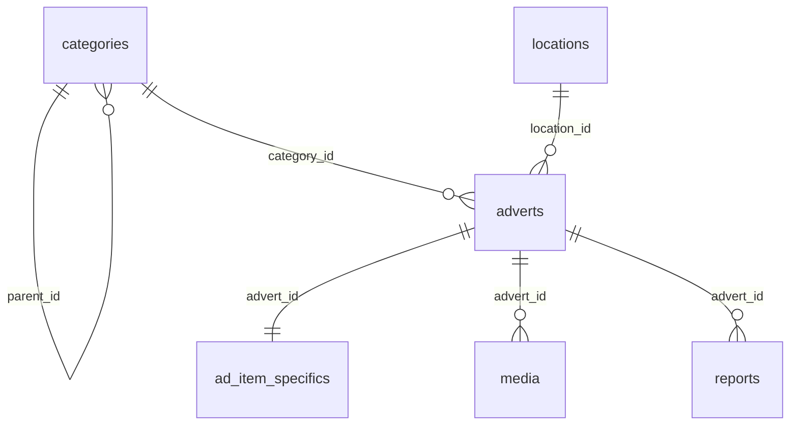

# LyVoX Requirements

> Связанные документы: [ARCH_RULES](./ARCH_RULES.md) • [ARCHITECTURE](./ARCHITECTURE.md) • [API_REFERENCE](./API_REFERENCE.md) • [INSTALL](./INSTALL.md) • [TODO](./TODO.md) • [PLAN](./PLAN.md)

<!-- Short aliases used by PLAN.md -->

<span id="REQ:Core"></span>
<span id="REQ:Security"></span>
<span id="REQ:Stack"></span>
<span id="REQ:Data"></span>
<span id="REQ:Quality"></span>
<span id="REQ:Integrations"></span>
<span id="REQ:Compliance"></span>
<span id="REQ:Roadmap"></span>

**Правило без дублей:** ограничения/версии — в ARCH_RULES.md; ERD/RLS/ENV/Roadmap — здесь; фактическая архитектура и журнал — в ARCHITECTURE.md; детальные API — в API_REFERENCE.md.

## Project Overview

LyVoX is a C2C/B2C marketplace focused on EU audiences that connects private sellers and businesses. The product allows visitors to browse category hierarchies, view listing details with image galleries, and post new adverts. Authentication relies on Supabase magic links, while trust-and-safety flows include phone verification, trust scoring, buyer complaints, and an admin moderation console.

Key capabilities implemented in the codebase:

- Category landing pages with nested navigation and breadcrumbs backed by Supabase `categories`.
- Listing creation workflow with draft creation, editing, publishing, and Supabase Storage uploads for media.
- Public advert detail pages displaying pricing, location, and gallery assets.
- Account area with profile details, trust score display, and phone verification via SMS codes.
- Complaint submission from advert pages and moderation tooling for administrators.

## System Architecture

### Frontend

- Next.js 15 App Router project (React 19, TypeScript) inside `apps/web`.
- Client components rely on the `@supabase/ssr` browser client to query Supabase tables in real time.
- Layout combines `TopBar`, `MainHeader`, `LegalFooter`, `BottomNav`, and `ViewportBottomSpacer` to optimize mobile UX.
- `middleware.ts` hydrates Supabase sessions on every request so API routes and server components can reuse auth context.
- UI elements are built on shadcn/ui patterns with Radix primitives (dialog, select, tabs) and Tailwind CSS 4.

### Backend / API

- Next.js API routes under `app/api/**` provide server-side operations for profile management, phone OTP, listings, and moderation.
- API handlers use `supabaseServer()` (anon key + cookies) for user-scoped queries and `supabaseService()` (service role) for privileged admin tasks.
- The auth callback route exchanges Supabase magic-link codes before redirecting back into the App Router experience.
- Logging is centralized in a `logs` table for audit trails on phone verification and moderation actions.
- `/api/auth/register` creates Supabase users with email verification, records `profiles.consents`, and redirects new sessions to the `/onboarding` checklist.

### Database & Storage

- Supabase Postgres hosts core tables: `adverts`, `media`, `categories`, `profiles`, `phones`, `phone_otps`, `reports`, `trust_score`, `logs`, plus supporting tables such as `ad_item_specifics`.
- Supabase migrations `20251004120000` ? `20251004122000` provision the `reports` and `trust_score` tables, attach `updated_at` triggers, seed baseline RLS, and expose the `trust_inc(uid, pts)` helper function.
- Supabase Storage bucket `ad-media` stores advert images; paths follow `user_id/advert_id/timestamp-filename`.
- Category taxonomy is seeded via `scripts/seedCategories.ts`, which consumes `seed/categories.ru.yaml`.
- Authentication data is provided by Supabase Auth (`auth.users`), reused across API handlers and RLS policies.

### Infrastructure & Integrations

- Application is designed for Vercel deployment (Next.js build scripts) and Supabase-hosted backend services.
- Twilio Lookup and Messaging APIs deliver OTP flows for phone verification and enrich phone metadata.
- Cloudflare WAF is planned as an upstream protection layer for the public site.
- Upcoming integrations include Itsme OAuth for KYC and KBO/BCE API checks for business accounts.

## Technologies & Libraries

- Next.js 15.5 with Turbopack, React 19, TypeScript 5.6.
- Tailwind CSS 4, `clsx`, `tailwind-merge` for styling utilities.
- Radix UI primitives wrapped in shadcn/ui components (`button`, `dialog`, `select`, `tabs`, etc.).
- Supabase client libraries: `@supabase/ssr` for browser/server helpers and `@supabase/supabase-js` for service role usage.
- Form handling and UX: `react-hook-form`, `sonner` toasts, `lucide-react` icons.
- Turborepo + pnpm workspace for monorepo orchestration; Husky + lint-staged enforce formatting.

## Authorization & Permissions

All critical flows rely on Supabase sessions. Admin functions should migrate from email comparisons to JWT `app_metadata.role` claims checked on the server (see TODO). Service-role access is limited to API routes instantiating `supabaseService()`.

### Permission Matrix

| Action                            | Guest                          | Authenticated User | Admin / Service Role              |
| --------------------------------- | ------------------------------ | ------------------ | --------------------------------- |
| Browse adverts, media, categories | ✅ read-only (public policies) | ✅                 | ✅                                |
| Create advert (draft)             | ❌                             | ✅ (owner)         | ✅                                |
| Edit advert                       | ❌                             | ✅ (owner)         | ✅                                |
| Delete advert                     | ❌                             | ✅ (owner)         | ✅                                |
| Upload / reorder media            | ❌                             | ✅ (owner)         | ✅                                |
| File report on advert             | ❌                             | ✅                 | ✅                                |
| List reports                      | ❌                             | ❌                 | ✅ (role="admin")                 |
| Resolve report (accept/reject)    | ❌                             | ❌                 | ✅ (role="admin")                 |
| Adjust trust score                | ❌                             | ❌                 | ✅ (`trust_inc` via service role) |
| Request phone OTP                 | ❌                             | ✅ (own phone)     | ✅                                |
| Verify phone OTP                  | ❌                             | ✅ (own phone)     | ✅                                |

## Row-Level Security & Access Policies

No migrations currently enable RLS on most domain tables. The following policies must be applied in Supabase (policies for `reports` and `trust_score` ship with migrations `20251004122000` and are refined in `20251005191500`). `auth.jwt()` or `auth.uid()` refer to Supabase helper functions.

### adverts

- **Current state:** RLS rules missing. Reads and writes require policies to protect ownership and published listings.
- **Target policies:**
  - `SELECT`: allow public access to rows where `status = 'active'`; allow owner (`user_id = auth.uid()`) and admins (`request.jwt()->>'role' = 'admin'`).
  - `INSERT/UPDATE/DELETE`: allow only authenticated owners; admins via service role may bypass via `auth.role() = 'service_role'`.
- **SQL (add after enabling RLS):**

```sql
alter table adverts enable row level security;
create policy "Public can read active adverts" on adverts
  for select using (status = 'active');
create policy "Owner can read own adverts" on adverts
  for select to authenticated using (user_id = auth.uid());
create policy "Owner manage own adverts" on adverts
  for all to authenticated using (user_id = auth.uid()) with check (user_id = auth.uid());
create policy "Admin can manage adverts" on adverts
  for all using (coalesce(request.jwt()->>'role','') = 'admin');
```

### media

- **Current state:** No policies. Media must be publicly viewable for active adverts but writable only by owners.
- **Target policies:**
  - `SELECT`: permit when owner or linked advert is active (`exists` join) or admin.
  - `INSERT/UPDATE/DELETE`: owner or admin only.
- **SQL:**

```sql
alter table media enable row level security;
create policy "Public view active advert media" on media
  for select using (
    exists (
      select 1
      from adverts a
      where a.id = media.advert_id
        and a.status = 'active'
    )
  );
create policy "Owner view media" on media
  for select to authenticated using (
    exists (
      select 1
      from adverts a
      where a.id = media.advert_id
        and a.user_id = auth.uid()
    )
  );
create policy "Owner manage media" on media
  for all to authenticated using (
    exists (
      select 1
      from adverts a
      where a.id = media.advert_id
        and a.user_id = auth.uid()
    )
  ) with check (
    exists (
      select 1
      from adverts a
      where a.id = media.advert_id
        and a.user_id = auth.uid()
    )
  );
create policy "Admin manage media" on media
  for all using (coalesce(request.jwt()->>'role','') = 'admin');
```

### categories

- **Current state:** No RLS (likely disabled) though table is seed-driven.
- **Policy goal:** expose read-only access to everyone, restrict writes to service role or maintenance procedures.

```sql
alter table categories enable row level security;
create policy "Public read categories" on categories for select using (true);
create policy "Service role manage categories" on categories
  for all using (auth.role() = 'service_role');
```

### profiles

- **Current state:** Missing RLS, yet profile data is sensitive PII.
- **Policies:**
  - `SELECT/UPDATE/INSERT`: owner only (`id = auth.uid()`), admins via service role.
  - `DELETE`: owner or service role.

```sql
alter table profiles enable row level security;
create policy "Owner read profile" on profiles
  for select to authenticated using (id = auth.uid());
create policy "Owner upsert profile" on profiles
  for insert with check (id = auth.uid());
create policy "Owner update profile" on profiles
  for update using (id = auth.uid()) with check (id = auth.uid());
create policy "Owner delete profile" on profiles
  for delete using (id = auth.uid());
create policy "Admin manage profiles" on profiles
  for all using (coalesce(request.jwt()->>'role','') = 'admin');
```

### phones

- **Current state:** No policies; table stores verified phone numbers and lookup data.

```sql
alter table phones enable row level security;
create policy "Owner read phone" on phones
  for select to authenticated using (user_id = auth.uid());
create policy "Owner upsert phone" on phones
  for all to authenticated using (user_id = auth.uid()) with check (user_id = auth.uid());
create policy "Admin manage phones" on phones
  for all using (coalesce(request.jwt()->>'role','') = 'admin');
```

### phone_otps

- **Current state:** No policies; OTP secrets must be owner-only with admin fallback.

```sql
alter table phone_otps enable row level security;
create policy "Owner read active OTP" on phone_otps
  for select to authenticated using (user_id = auth.uid());
create policy "Owner manage OTP" on phone_otps
  for all to authenticated using (user_id = auth.uid()) with check (user_id = auth.uid());
create policy "Admin manage OTP" on phone_otps
  for all using (coalesce(request.jwt()->>'role','') = 'admin');
```

### reports (existing)

- `SELECT`: authenticated users see reports they filed or on adverts they own.
- `INSERT`: authenticated users may create reports for themselves (`reporter = auth.uid()`).
- `UPDATE/DELETE`: currently service role only (no policy, rely on admin RPC/`supabaseService()`).

### trust_score (existing)

- `SELECT`: authenticated owners read their own scores (`user_id = auth.uid()`).
- `INSERT/UPDATE/DELETE`: reserved for service role via `trust_inc` or admin tooling.

### logs

- **Current state:** No policies. Server actions log events via anon key; policy needed to restrict inserts to authenticated sessions while keeping records private.

```sql
alter table logs enable row level security;
create policy "Owner insert log" on logs
  for insert to authenticated with check (user_id = auth.uid());
create policy "Service role read logs" on logs
  for select using (auth.role() = 'service_role' or coalesce(request.jwt()->>'role','') = 'admin');
```

## API Surface

Detailed request/response contracts, error codes, and curl recipes are documented in `docs/API_REFERENCE.md`. Update that file whenever API handlers change.

## Environment Variables

| Name                            | Required    | Scope           | Notes                                                                |
| ------------------------------- | ----------- | --------------- | -------------------------------------------------------------------- |
| `NEXT_PUBLIC_SUPABASE_URL`      | yes         | client & server | Supabase project URL (exposed publicly).                             |
| `NEXT_PUBLIC_SUPABASE_ANON_KEY` | yes         | client & server | Supabase anon key used by browsers and middleware.                   |
| `NEXT_PUBLIC_SITE_URL`          | recommended | client          | Canonical site origin for link generation (non-sensitive).           |
| `SUPABASE_SERVICE_ROLE_KEY`     | yes         | **server-only** | Service role key for admin APIs; never expose to client bundles.     |
| `SUPABASE_URL`                  | dev scripts | server          | Base URL used by `scripts/seedCategories.ts`.                        |
| `TWILIO_ACCOUNT_SID`            | yes         | server          | SID for Twilio Lookup & Messaging APIs.                              |
| `TWILIO_AUTH_TOKEN`             | yes         | server          | Secret auth token for Twilio (OTP SMS).                              |
| `TWILIO_FROM`                   | yes         | server          | Verified Twilio sender number.                                       |
| `TWILIO_LOOKUP_URL`             | yes         | server          | Lookup endpoint (e.g. `https://lookups.twilio.com/v2/PhoneNumbers`). |
| `UPSTASH_REDIS_REST_URL`        | yes         | server          | Redis REST endpoint for rate limiting (Upstash).                     |
| `UPSTASH_REDIS_REST_TOKEN`      | yes         | server          | Redis auth token for rate limiting.                                  |
| `RATE_LIMIT_OTP_USER_PER_15M`    | optional    | server          | Override OTP attempts per user (default 5 per 15 minutes).           |
| `RATE_LIMIT_OTP_IP_PER_60M`      | optional    | server          | Override OTP attempts per IP (default 20 per 60 minutes).            |
| `RATE_LIMIT_REPORT_USER_PER_10M` | optional    | server          | Override report submissions per user (default 5 per 10 minutes).     |
| `RATE_LIMIT_REPORT_IP_PER_24H`   | optional    | server          | Override report submissions per IP (default 50 per 24 hours).        |
| `RATE_LIMIT_ADMIN_PER_MIN`       | optional    | server          | Override admin moderation actions per minute (default 60).           |
| `SUPABASE_JWT_ADMIN_ROLE`       | planned     | server          | Optional custom claim key to detect admin role.                      |

`NEXT_PUBLIC_ADMIN_EMAIL` must be removed; use Supabase JWT claims (`app_metadata.role`) to show admin UI affordances client-side.

## Rate Limiting Plan

Rate limiting is enforced via Upstash Redis in `apps/web/src/lib/rateLimiter.ts` with sliding windows tuned to the risk profile of each endpoint:

- **OTP request** (`/api/phone/request`)
  - `otp:user:<uid>` — 5 requests per 15 minutes (registered users).
  - `otp:ip:<ip>` — fallback 5 requests per 15 minutes when the caller is anonymous.
  - `otp:ip:<ip>` — global IP guard: 20 requests per 60 minutes.
- **User complaints** (`/api/reports/create`)
  - `report:user:<uid>` — 5 submissions per 10 minutes.
  - `report:ip:<ip>` — 50 submissions per 24 hours.
- **Admin moderation** (`/api/reports/list`, `/api/reports/update`)
  - `report:admin:<uid>` — 60 operations per minute to throttle scripted access.

When a window is exceeded the server returns **HTTP 429** with a JSON payload:

```json
{
  "error": "rate_limited",
  "retryAfter": 42,
  "limit": 5,
  "remaining": 0,
  "resetAt": "2025-10-05T18:30:00.000Z"
}
```

Standard headers accompany the response for automated retries: `Retry-After` (seconds), `RateLimit-Limit`, `RateLimit-Remaining`, and `RateLimit-Reset` (epoch seconds). Client code is expected to honour these values—see `apps/web/src/lib/fetcher.ts` for the shared handler that surfaces a `RateLimitedError` to UI components.

All tunables fall back to the defaults above; override via the `RATE_LIMIT_*` environment variables when higher quotas are justified (e.g. trusted internal networks).

## Database Schema

_Source of truth: generated types in `supabase/types/database.types.ts`. The linked `supabase/schema.sql` dump currently carries no extra constraints beyond those types._

### Domain tables

- **public.adverts** — marketplace listings keyed by `id uuid`. Stores `title`, optional `description`, pricing fields (`price numeric`, `currency text`), `condition text`, free-form `location text`, and audit timestamps (`created_at`, `updated_at`). Ownership is tracked with `user_id uuid` (logical link to `auth.users`). Foreign keys: `category_id uuid → public.categories.id`; `location_id uuid → public.locations.id` (nullable). `status text` follows the app workflow (`draft`, `active`, `inactive`, `archived`).
- **public.ad_item_specifics** — one-to-one JSON payload per advert. Columns: `advert_id uuid → public.adverts.id` (unique) and `specifics jsonb` for arbitrary key/value details.
- **public.categories** — hierarchical taxonomy. Columns include `id uuid` (PK), `parent_id uuid` self-reference, `level int`, `slug`, `path`, optional `icon`, multilingual labels (`name_ru` plus optional `name_en`/`name_fr`/`name_nl`), `sort int`, and `is_active boolean`.
- **public.locations** — normalized geodata for adverts. Stores `id uuid`, optional `country`, `region`, `city`, `postcode`, and a PostGIS point (`point geometry`). Referenced from `public.adverts.location_id`.
- **public.media** — advert media assets. Columns: `id uuid`, `advert_id uuid → public.adverts.id`, `url text`, optional dimensions `w`/`h` (numeric), `sort int` for ordering, and `created_at` timestamp.
- **public.profiles** — user profile metadata keyed by `id uuid` (matches Supabase Auth users). Contains optional `display_name`, `phone`, verification flags (`verified_email`, `verified_phone`), and `created_at`.
- **public.phones** — latest verified phone per user. Columns: `user_id uuid` (logical PK), `e164 text`, `verified boolean`, `updated_at timestamptz`, and optional `lookup jsonb` (Twilio carrier metadata).
- **public.phone_otps** — OTP tokens. Stores `id bigint`, `user_id uuid` (nullable for pre-auth flows), `e164 text`, `code text`, `attempts int`, `expires_at timestamptz`, `created_at timestamptz`, and `used boolean`. No foreign keys are declared.
- **public.reports** — moderation complaints. Columns: `id bigint`, `advert_id uuid → public.adverts.id`, `reporter uuid` (Supabase Auth user ID), `reason text`, optional `details text`, `status text`, `reviewed_by uuid` (nullable), and audit timestamps.
- **public.trust_score** — trust reputation ledger keyed by `user_id uuid`, with `score int` and `updated_at timestamptz`.
- **public.logs** — audit trail. Columns: `id bigint`, `action text`, optional `details jsonb`, `user_id uuid` (nullable), and `created_at timestamptz`.

### System tables & views

- **public.spatial_ref_sys** plus the PostGIS helper views (`geometry_columns`, `geography_columns`, etc.) are managed by the PostGIS extension and not directly manipulated by the application.

_Fields such as `user_id` across `adverts`, `profiles`, `phones`, `phone_otps`, `trust_score`, and `logs` reference Supabase Auth user IDs at the application layer, but no foreign-key constraint is declared in the canonical schema._

### Supporting Functions & Triggers

- `set_updated_at()` — keeps `updated_at` in sync on mutable tables (`reports`, `trust_score`).
- `trust_inc(uid, pts)` — service-role helper invoked by moderation flows to increment `public.trust_score`.

### Entity-Relationship Diagram



## Compliance (GDPR / DSA)

| Table / System                          | Data Category                              | Purpose                              | Retention                                        | Legal Basis                           | Notes                                                                             |
| --------------------------------------- | ------------------------------------------ | ------------------------------------ | ------------------------------------------------ | ------------------------------------- | --------------------------------------------------------------------------------- |
| `profiles`, `auth.users`                | Personal identifiers (email, display name) | Account management, communications   | Active account + 24 months                       | Contract (ToS)                        | Users can self-edit; DSAR exports via Supabase `select` filtered by `auth.uid()` and include consent snapshots. |
| `phones`, `phone_otps`                  | Contact data, OTP secrets                  | Stronger authentication, Trust Score | OTP rows: 24h; phones: life of account           | Legitimate interest (security)        | Ensure cron purges expired OTPs; phone deletion on DSAR request.                  |
| `adverts`, `media`, `ad_item_specifics` | User-generated content                     | Marketplace listings                 | Until user removes or 24 months after inactivity | Contract; Legitimate interest         | Provide delete button; include in export for DSAR.                                |
| `reports`                               | Moderation records, reporter IDs           | DSA compliance, risk mitigation      | Minimum 12 months post resolution                | Legal obligation (DSA)                | Must be retrievable for regulators; status changes logged.                        |
| `trust_score`                           | Derived behavioural score                  | Reputation management                | Lifetime of account (resettable)                 | Legitimate interest; consent (in ToS) | Document adjustments in `logs`.                                                   |
| `logs`                                  | Audit metadata (IP hashes optional)        | Security, moderation audit           | 18 months                                        | Legitimate interest                   | Should include moderation decisions & rate-limit triggers.                        |
| Cloudflare                              | Metadata (IP, request headers)             | WAF protection                       | ~24 hours (default)                              | Legitimate interest                   | Configure EU data centres.                                                        |
| Vercel                                  | Application logs                           | Hosting & operations                 | 30 days (default)                                | Legitimate interest                   | Ensure logging level minimises PII.                                               |
| Supabase                                | DB, storage, auth                          | Core data processing                 | Configurable                                     | Contract                              | Acts as processor; sign DPA.                                                      |

**DSAR workflow:**

1. Verify requester via Supabase auth.
2. Use service role to gather data from `profiles`, `phones`, `adverts`, `media`, `reports`, `logs` (filter by `user_id`).
3. Provide export (JSON/CSV) within 30 days; delete on request by cascading RLS-compliant deletes.

**Moderation audit:** `logs` table must capture `report_create`, `report_update`, `phone_request`, `phone_verify`, `rate_limit_block` actions with timestamps for regulator review.

## Operations & Deployment Overview

- Local setup, database bootstrapping, and deployment workflows are detailed in `docs/INSTALL.md`.
- Production must enforce Cloudflare WAF rules (IP reputation, bot protection, Geo EU) and tie into Zero Trust policies outlined in the installation guide.

## Roadmap

- Add self-service consent management (opt-in/out, version history export) in profile settings.
- Consolidate category routing (`/c/[categoryPath]`) to serve listings directly and improve SEO.
- Monitor Upstash rate limiting metrics and adjust quotas for regional traffic spikes.
- Expand automated tests for API routes and Supabase policies (auth, reports, phone verification).
- Document and automate Cloudflare WAF plus Zero Trust posture in infrastructure-as-code.
- Supabase Edge Function `maintenance-cleanup` runs daily (02:00 UTC) to purge expired OTP secrets and anonymise audit logs older than 18 months; see `supabase/functions/maintenance-cleanup` for implementation and scheduling.

-## Project Overview
+## Project Overview {#project-overview}

-## Technologies & Libraries
+## Technologies & Libraries {#technologies--libraries}

-## System Architecture
+## System Architecture {#system-architecture}

-## Database Schema
+## Database Schema {#database-schema}

-## Infrastructure & Integrations
+## Infrastructure & Integrations {#infrastructure--integrations}

-## Compliance (GDPR / DSA)
+## Compliance (GDPR / DSA) {#compliance-gdpr--dsa}

-## Roadmap
+## Roadmap {#roadmap}

-## Authorization & Permissions
+## Authorization & Permissions {#authorization--permissions}
