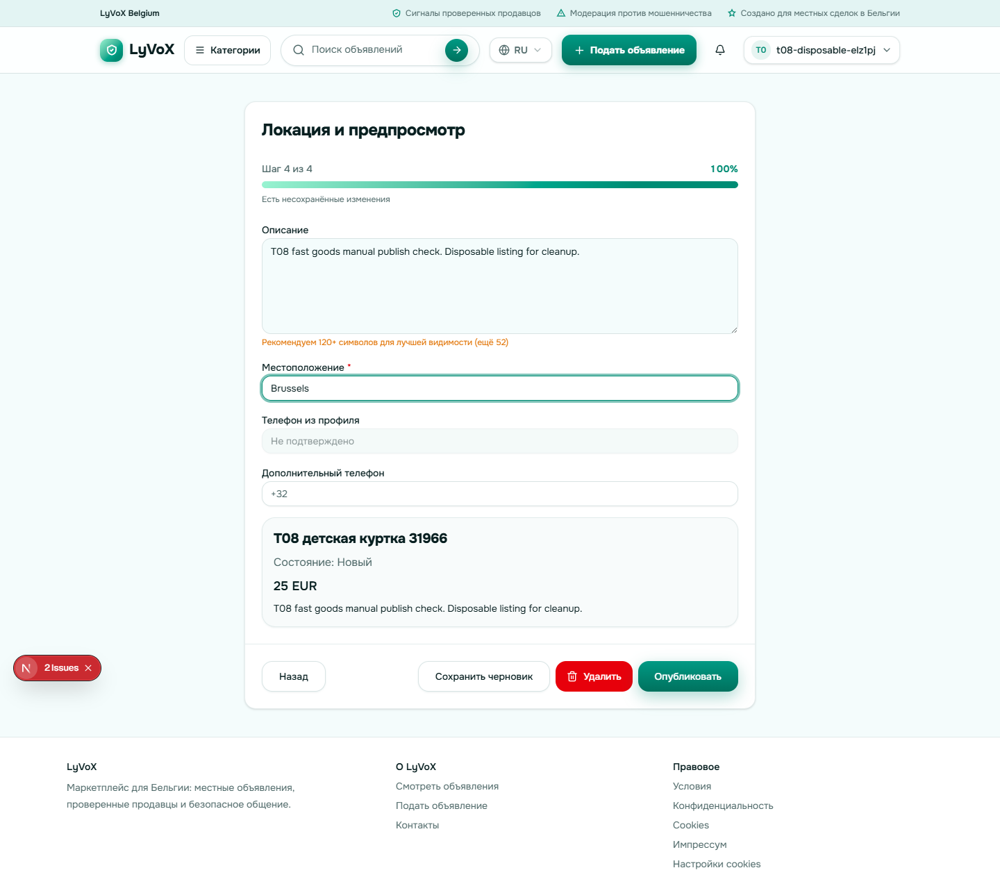
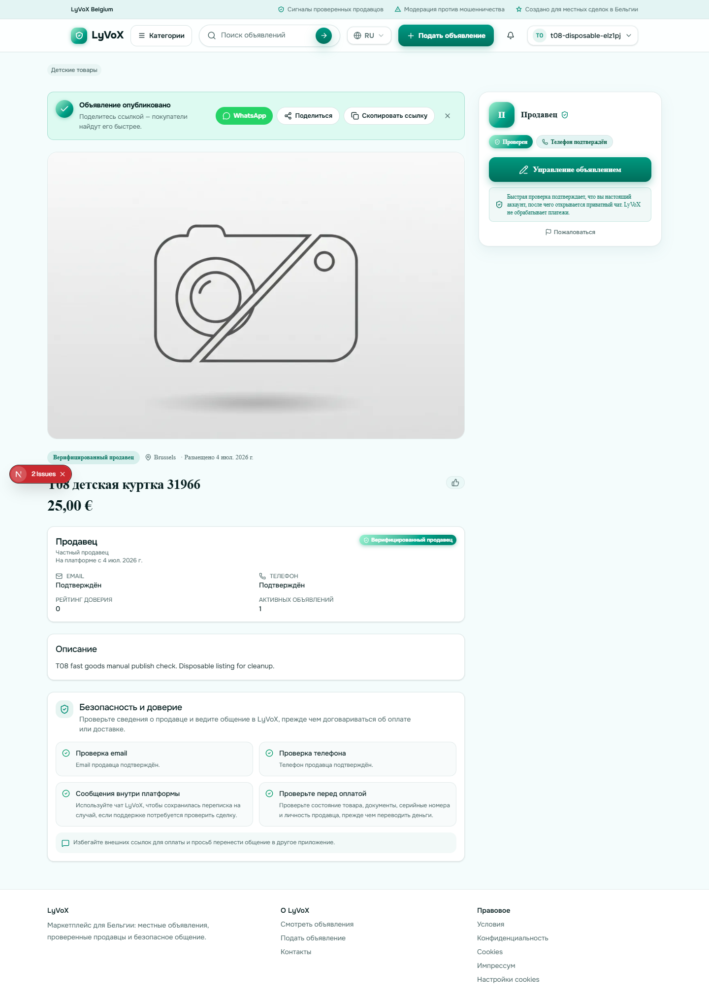
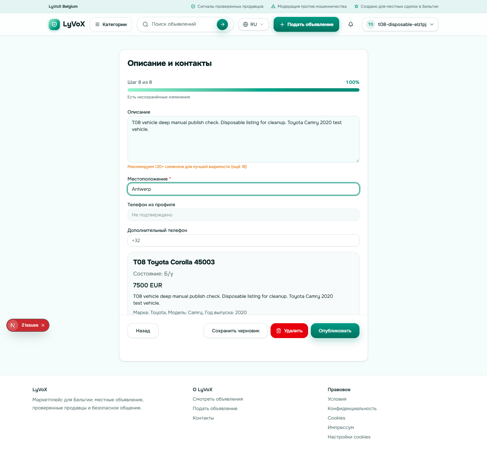
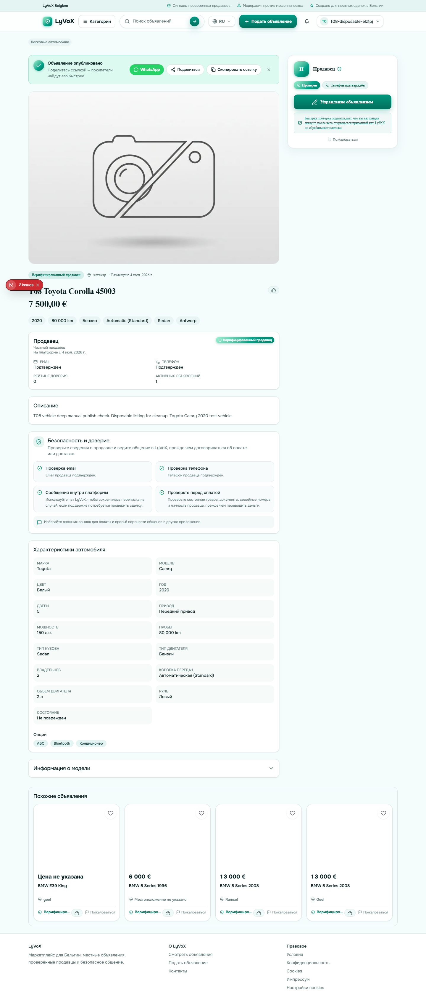
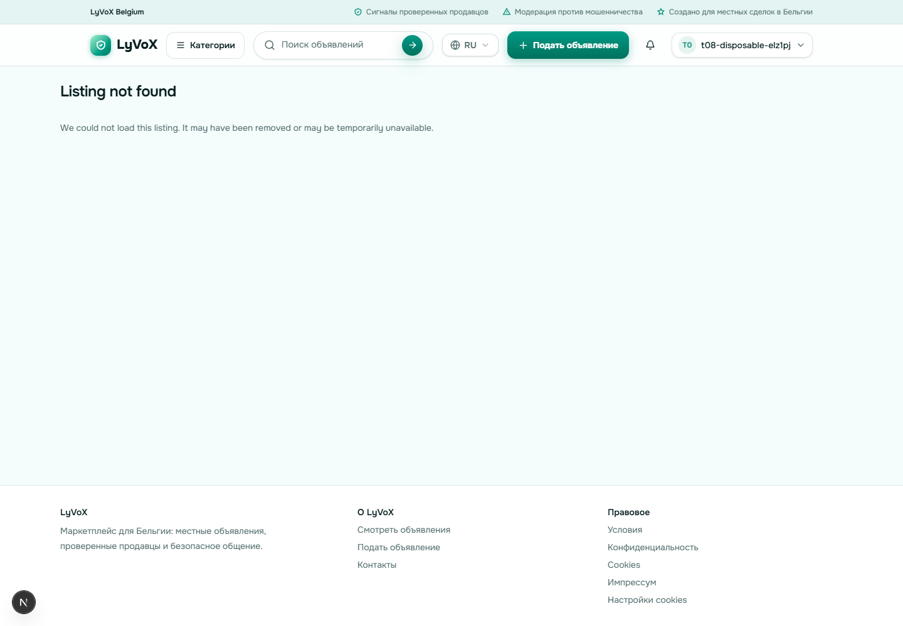
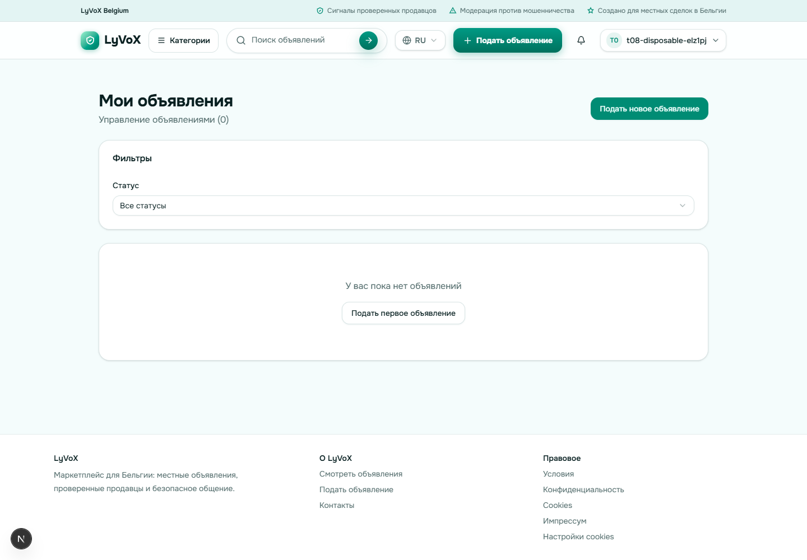

> [!NOTE]
> **ARCHIVED VERIFICATION EVIDENCE.** Это датированный локальный evidence-снимок, не текущий release status и не разрешение на rollout. Канонический статус: [`docs/MASTER_PRODUCTION_TZ.md`](../../MASTER_PRODUCTION_TZ.md).

# T08 Verification

Date: 2026-07-04
Branch: `feat/post-fast-goods`
Environment: local dev server at `http://localhost:3000`, Chrome automated through Playwright for manual UI coverage.

Credentials were loaded only from the ignored local file `docs/todo/notes/t08-test-account.local.json`. The credential values are not copied into this report.

## Manual Publish Flows

### fast_goods

Result: passed.

- Category path: simple goods category, not a deep vertical.
- Required flow length: 4 steps.
- Verified screens: photo upload, category plus title, price plus condition, location plus preview.
- Published listing id: `76872cc8-4975-4d95-95f7-1f1c4cf7423a`.
- Cleanup: deleted immediately through `/profile/adverts` UI. Reopening `/ad/76872cc8-4975-4d95-95f7-1f1c4cf7423a` showed `Listing not found`.

Evidence:

### vehicle_deep

Result: passed.

- Category path: Transport -> passenger cars.
- Required flow length after category selection: 8 steps.
- Verified screens: photo upload, category plus title, condition, vehicle basics, technical specifics, price and state, options, location plus preview.
- Published listing id: `723112c2-b3ab-40f5-aaff-f08d407e0991`.
- Cleanup: deleted immediately through `/profile/adverts` UI. Reopening `/ad/723112c2-b3ab-40f5-aaff-f08d407e0991` showed `Listing not found`.

Evidence:

## Cleanup

The disposable account remains in place for purge-key cleanup. All listings and the remaining draft created by this run were removed through the UI. `/profile/adverts` ended at zero listings.

## Browser Signals

- Page errors: 0.
- Console errors: Next.js dev source-map warnings only (`Invalid source map. Only conformant source maps can be used...`).
- Failed requests: 1 aborted RSC navigation request while leaving an edit page; no user-visible failure.
